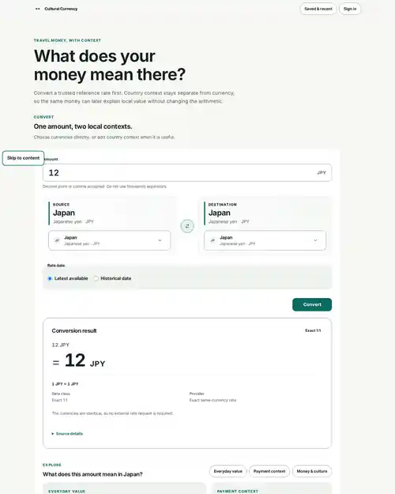

# Cultural Currency Converter

> Convert money. Understand local value. Discover culture.

Cultural Currency Converter is a Django-first travel-money product. It combines trustworthy currency conversion with practical destination context: what an amount can roughly buy, how people tend to pay, and relevant money/culture stories.

<p align="center">
  
</p>

## What works today

The web product currently includes:

- current and historical FX conversion with source/effective-date semantics;
- bilateral country/currency context;
- historical charts and Then & Now comparison;
- sourced everyday-value and payment context;
- deterministic Money & culture stories;
- managed media with Quiet Atlas fallbacks;
- an optional, explicit AI explanation with deterministic fallback;
- anonymous browser-local favourites/recent conversions;
- signed-in favourite ownership and opt-in cross-device recent history.

The product remains useful when optional enrichment, media or AI is unavailable.

## Current architecture

```text
Browser
  ↓
Django templates + HTMX + small TypeScript enhancements
  ↓
Application/use-case layer
  ↓
Domain rules
  ↓
Django ORM / cache / provider adapters
  ↓
PostgreSQL or SQLite (local) + external data providers
```

Current web stack:

- Python 3.13/3.14, Django 5.2;
- Django templates, HTMX 2, TypeScript, Vite 8, Tailwind 4;
- PostgreSQL in production-oriented environments, SQLite for lightweight local work;
- Frankfurter for runtime FX;
- optional Gemini explanation behind server-side configuration;
- Playwright/axe browser quality checks.

Implementation details are allowed to evolve when a better solution is justified. The code, tests and CI are the authoritative record of what is implemented now.

## Documentation

Start with [docs/00_INDEX.md](docs/00_INDEX.md).

For AI-assisted development, read [docs/AI_DEVELOPMENT_GUIDE.md](docs/AI_DEVELOPMENT_GUIDE.md) before making a non-trivial change.

The documentation is intentionally compact. It captures product intent, important invariants, current architecture and active direction. Historical PR plans and duplicate specification layers are deliberately not kept as competing sources of truth.

## Local development

Python:

```bash
python -m pip install -e ".[dev]"
python manage.py migrate
python manage.py seed_reference_data
python manage.py seed_story_data
python manage.py seed_destination_context
python manage.py runserver
```

Frontend:

```bash
cd frontend
npm ci
npm run dev
```

Useful checks:

```bash
ruff format --check apps config scripts manage.py
ruff check apps config scripts manage.py
djlint templates --check
python manage.py check
python manage.py makemigrations --check --dry-run
coverage run -m pytest -q
coverage report
```

```bash
cd frontend
npm run quality
npm run browser:quality
```

See [CONTRIBUTING.md](CONTRIBUTING.md) for the practical development workflow.

## Product direction

The immediate focus is to keep improving the web product and its architecture based on real product value. A versioned mobile API and native mobile client are candidates for later development, but their exact framework/library choices should be re-evaluated when implementation starts rather than treated as permanent commitments today.
